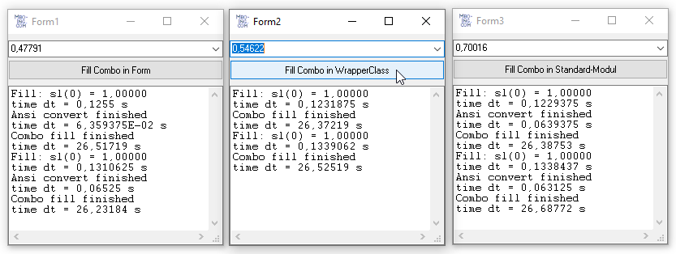

# Ctrl_FastComboBox  
## Fast filling a ComboBox with some win-api functions  

Project started in jun.2020, this one is dead. I swear last year it gave a boost to filling a ComboBox with 100000 string-elements.
Better use the Virtual-ComboBox in either 
* Krools Control-Collection https://github.com/Kr00l/VBCCR  
* Olaf Schmidts Virtual-ComboBox  https://www.vbforums.com/showthread.php?864051-VB6-Simple-Virtual-ComboBox-(OwnerDrawn)  

